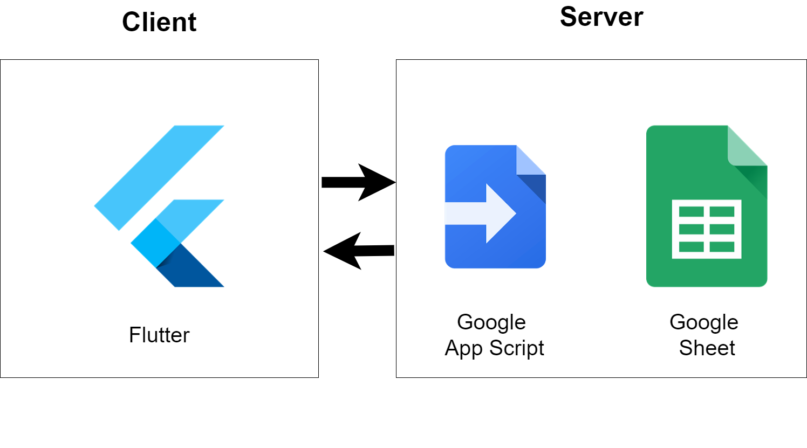

# Google-Sheet-with-Flutter
 
## Prerequisites:
- Flutter
- Google App Script
- Google Sheet

## Infrastructure

## Project Structure
* lib
    * main.dart
      * Application Home Page
    * model
      * Transaction.dart
      * TransactionType.dart
    * page
      * AddTransactionPage.dart
      * ListTransactionPage.dart
    * service
      * TransactionService.dart
* resource
    * script
      * doGet.gs
      * doPost.gs

### Blog
[Flutter + AppScript+ Google Sheet]: 
